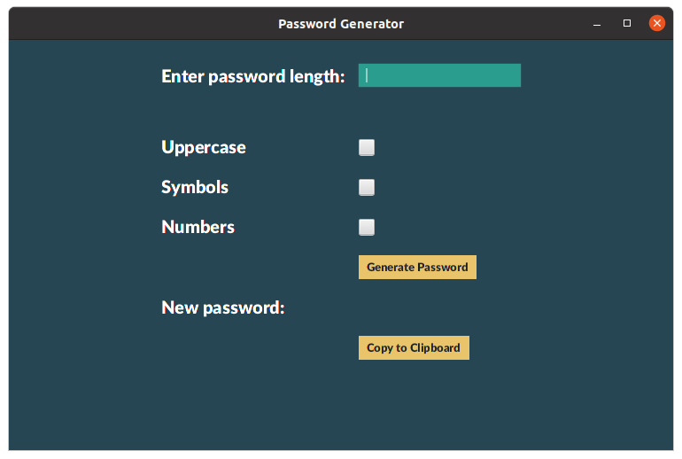
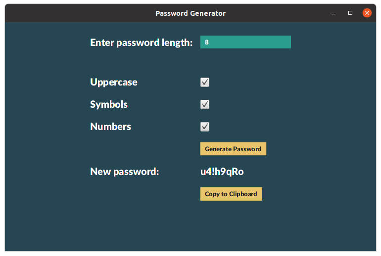
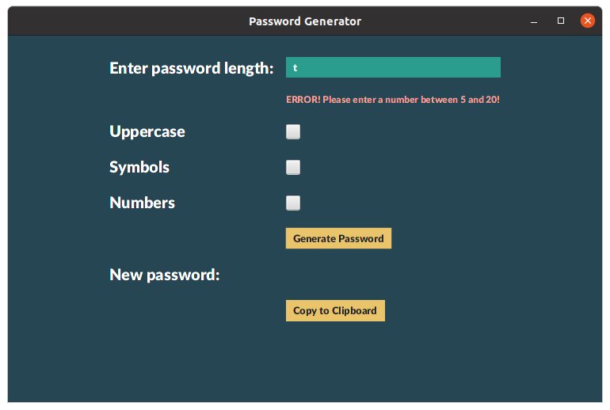

# Random Password Generator
This program generates a random password for the user. The password always has lowercase letters, and that is the default if no other boxes are selected. The user can select uppercase letters, symbols, and/or numbers for their password. They can also specify the password length that they would like. After the password is generated, the user can click "Copy to Clipboard" to automatically copy the password to the user's clipbaord   
This program uses the JavaFX framework to create a graphical user interface (GUI). It is styled with a bit of CSS.

